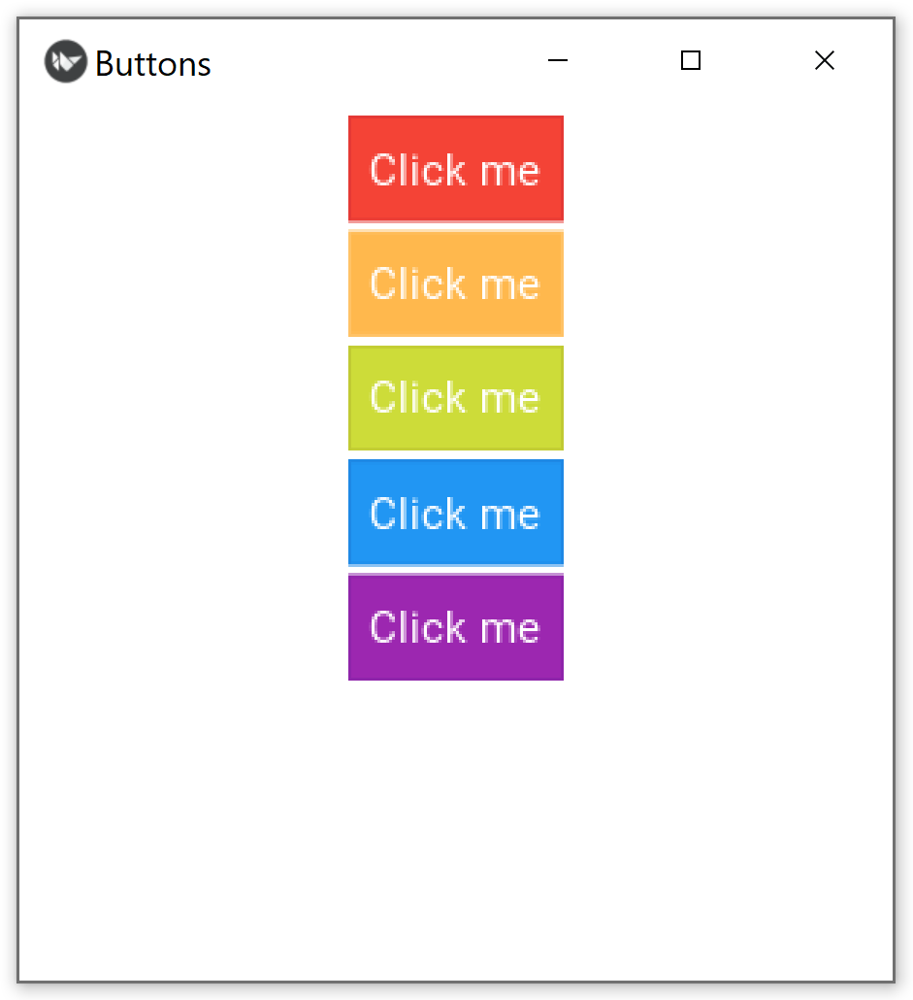

=====================
Kivy button generator
=====================

A simple project to generate buttons for the Kivy framework.

:Author: marcinooo
:Tags: python, Kivy, button, generator

|

Description
===========

To change the default button color in the kivy framework, we should assign two images for the 'background_normal' and 'background_down' properties of the button. 
This will allow us to keep the effect of pressing the button which is compatible with UX. The project contains a script that allows generating images for the Kivy framework button. 
The script returns images for the 'background_normal' and 'background_down' properties.

|

Installation
============

Run development server:

``> python -m venv venv``

``> venv\Scripts\activate``

``> pip install -r requirements.txt``

``> python generate.py``

Example
=======

**Kivy must be installed before running the examples.**
 
To install Kivy, follow the instructions on the official Kivy website_.

.. _website: https://kivy.org/doc/stable/gettingstarted/installation.html

After installation, run the demo program with the command:

``> python example/main.py``

As a result you will see:

|

|

License
=======

license_ (MIT)

.. _license: https://github.com/martinwac/Kivy-button-generator/blob/master/LICENSE

